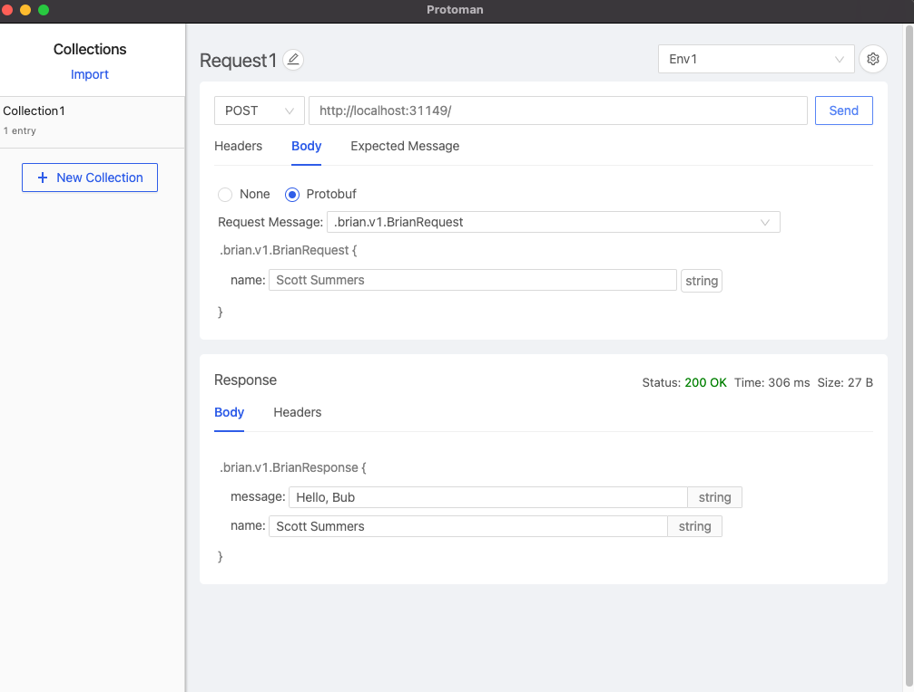

# Giraffe Protobuf Example

This is an example project to output protobuf from a [Giraffe](https://github.com/giraffe-fsharp/Giraffe) server.

The goal of this project is to explore more idiomatic ways of obtaining dependencies as described in [this article](https://mcode.it/blog/2020-12-11-fsharp_composition_root/)

## Run the server

```sh
$ dotnet run --project webapp
Hosting environment: Development
Content root path: /.../webapp
Now listening on: http://localhost:31149
```

## Try it out

Can use [Protoman](https://github.com/spluxx/Protoman/) to send requests or use the python client



[or try the python client](client/README.md)
