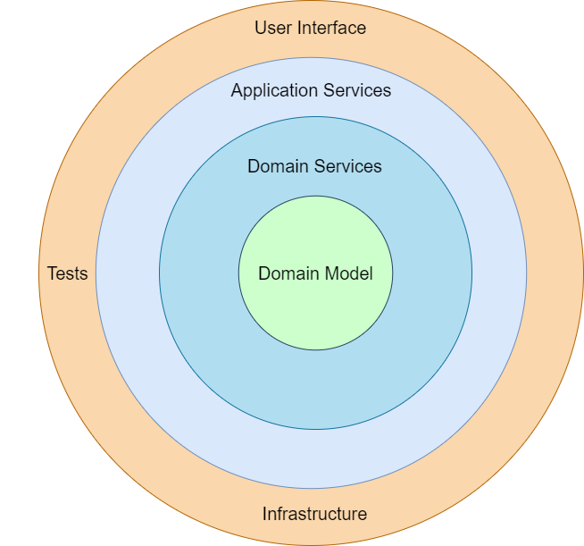

# Web App

This demo application shows dependency injection by composing dependencies using partial application in order to create code in a more testable way.

## Revisiting Onion Architecture

## Mapping the Code to the Onion

| In the onion         | In the code                            |
| -------------------- | -------------------------------------- |
| User Interface       | API.HelloRouter.helloHandler           |
| Infrastructure       | Repository.HelloRepository.getNickname |
| Application Services | API.HelloService.sayHello              |
| Domain Services      | Domain.Hello.sayHello                  |
| Domain Model         | Domain.Greeting                        |
